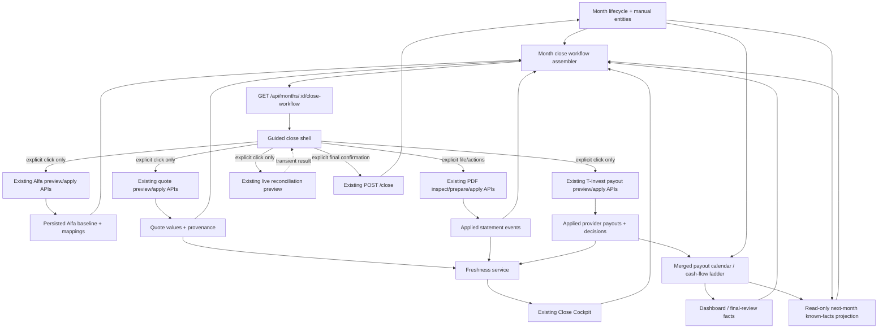

# Issue #236 — Guided Monthly Close Wizard: Architecture and Product Design

> Non-normative design proposal for issue #236. Architecture/product design only; no implementation.
> Source-of-truth precedence remains AGENTS.md, MASTER_SPEC.md, accepted ADRs, the active GitHub issue contract, and other canonical project policy documents.

## Investigation checkpoint

- Status: architecture/product design complete; implementation not started.
- Workspace: `workspaces/codex/issue-236-ultra-design/`.
- Canonical baseline: `origin/main` at `b520a7a4ab95f00e3e1fb971be148c1e8da41be4` (fetched 2026-08-30; independent remote read-back reconfirmed 2026-08-31).
- Checkout mode: detached worktree; no task branch, commit, push, or PR.
- Verified constraints: the backend remains the financial source of truth; closed months are immutable until explicit reopen; provider/network actions are explicit; private/runtime data is out of scope.
- Final audit: backend/API and normative/red-team passes incorporated; all requested design areas, implementation slices, edge cases, A–G recommendation and owner walkthrough are complete.

## Source and evidence ledger

| Source | Status | Design facts extracted |
|---|---|---|
| `AGENTS.md` | Read | Source precedence, runtime/privacy isolation, closed-month immutability, backend authority, scope restrictions. |
| [Issue #236](https://github.com/LTstripes/hermes-finance/issues/236) and owner comment | Read | Owner-first guided orchestration; one next action; deterministic resumability; explicit provider calls; consume Close Cockpit; owner clarification moves remaining manual-only review after provider/import reconciliation unless a field is a true prerequisite. |
| [Issue #229](https://github.com/LTstripes/hermes-finance/issues/229) and owner comment | Read | UI primitive/foundation: Alfa grouping, bulk actions, selective apply, technical-detail demotion, explicit instrument creation; broad implementation waits for real Stable August close UAT. |
| [Issue #237](https://github.com/LTstripes/hermes-finance/issues/237) | Read | Separate explicit analysis-package handoff; #236 may link to it after readiness, but must not absorb export/LLM scope or perform automatic upload. |
| `docs/MASTER_SPEC.md` | Read | Backend owns all money/formulas; draft/closed month and snapshot date are distinct; clone copies continuing state and resets actual events; provider actions are explicit; no background quote calls; redemption is capital, not passive income; future rows are not implicit actuals. |
| Accepted ADRs 0002, 0003, 0008–0016 | Read | Closed-history effects; income cash-flow flags/double-count guard; explicit provider lifecycles; mapping/exclusion; quote target/freshness; T payout coverage and frozen quantity; Alfa one-shot/loopback/preview/selected apply/comparison-only fields; runtime-profile isolation. |
| `docs/VERIFICATION_POLICY.md` | Read | Risk- and layer-proportional checks; shared DTO changes verify both layers; one final full suite per changed layer; docs-only needs diff/format/privacy checks, not product suites. |
| `docs/PROJECT_WIKI.md` | Read | Current 0.7 surface, product/source precedence, close/freshness/reconciliation/runtime boundaries, accepted selective-apply behavior and deferred #229/projection work. |
| Current backend APIs/read models | Read | Lifecycle/manual/provider commands already exist. Genuine gap is a provider-free composite workflow/final-review DTO plus narrow read-only dependency comparators; v1 needs no persistence. |
| Current frontend monthly workflows | Read | Work is split across month editor, Accounts, Payouts, Reconciliation, Freshness and Cockpit; only month sections have deterministic deep links; global pages need selected-month/return orchestration. |

### Normative decisions that constrain the wizard

- **Backend authority:** all money and financial formulas remain backend-owned (`docs/MASTER_SPEC.md:605-607`; `docs/PROJECT_WIKI.md:112-121`). The wizard may compose existing values, never reproduce them.
- **Income composition:** `include_in_cash_flow` and `include_in_passive_income` remain independent backend rules; passive `OTHER` is counted once and cashback remains non-passive (`docs/adr/0003-income-cash-flow-inclusion.md:20-55`, `57-93`). The manual/final screen displays backend buckets instead of rejoining income rows.
- **Close is a lifecycle fact:** a closed month is immutable until explicit reopen, and reopen also removes it from salary known-history and eligible CLOSED passive-income history until it is closed again (`docs/adr/0002-opening-ytd-gross.md:91-104`; `docs/adr/0008-passive-income-history-eligibility.md:64-80`, `210-228`). Every step must therefore be re-derived after reopen.
- **Quote contract:** explicit mapping/preview/apply; target `min(snapshot_date, today)`; 0–7 days usable, 8–30 stale, over 30 unavailable; no background retry; closed-month apply is forbidden (`docs/adr/0009-moex-market-identity-and-quote-semantics.md:67-81`, `83-135`, `210-246`).
- **T-Invest payout contract:** explicit fetch/preview/select/apply; no polling/background retry; successful absence is valid only after exact structurally valid coverage; quantity is local and frozen on apply; Apply itself re-reads provider/local state and may return zero-write `preview_changed` (`docs/adr/0011-automatic-investment-payout-calendar.md:18-53`, `227-277`, `305-335`).
- **Alfa PRO contract:** one-shot, owner-triggered and loopback-only; Preview is mandatory; entities/mappings are never silently created; baseline apply requires compatible complete snapshot, explicit selected identities, editable month and `baseline_date == snapshot_date` (`docs/adr/0013-broker-snapshot-and-alfa-pro-security.md:63-112`, `165-193`; `docs/adr/0016-owner-approved-alfa-baseline-and-broker-mappings.md:181-208`).
- **Alfa write boundary:** only confirmed identities, selected positive quantities and narrow provenance persist. Provider Price/UchPrice/NKD/P&L/cash/classification remain comparison-only; later mapping changes do not rewrite historical applies (`docs/adr/0016-owner-approved-alfa-baseline-and-broker-mappings.md:161-179`, `210-304`).
- **Freshness:** provider observation, import/apply, reporting period and local edit are separate clocks; apply time is not freshness; no universal score; non-quote provider families are not quote-age classified (`docs/FRESHNESS_PROVENANCE.md:1-28`, `32-77`).
- **Runtime isolation:** Stable and Preview are separate checkout/config/database profiles on one loopback origin; only Stable may open production data, and the explicit one-way Preview copy copies the full database (`docs/adr/0014-launcher-runtime-profile-safety.md:40-90`, `332-360`, `383-395`). Browser-local wizard progress would therefore be both ambiguous and unsafe.
- **Verification:** future API/shared-contract slices require backend and frontend contract checks; cross-layer delivery requires targeted checks and one stabilized full suite per changed layer plus the frontend build (`docs/VERIFICATION_POLICY.md:64-72`, `97-99`).

There is one source-document tension to record rather than silently reinterpret. The old future-looking PDF paragraph says Alfa would be truth for imported quantities, prices and payouts (`docs/MASTER_SPEC.md:1308-1326`), while the accepted current Alfa/PDF contracts are narrow and make provider valuation fields comparison-only. #236 follows the implemented accepted narrow contracts and should open separate documentation debt; it must not reactivate a generic Alfa PDF holdings/price importer.

## Guardrails for the proposed design

1. Derive wizard status from authoritative persisted evidence wherever possible; do not invent frontend completion flags.
2. Reuse backend calculations/read models; do not duplicate financial formulas or reconciliation/close semantics in React.
3. Every provider interaction is an explicit owner action with a visible preview/result and retry path. Merely opening the wizard performs no network call.
4. Distinguish `skipped`/not applicable from incomplete and preserve the reason.
5. A completed step may become stale when its authoritative dependencies change; the state model must expose why and the next safe action.
6. Closing remains an explicit backend-governed action with existing blockers and explicit reopen semantics.
7. No forecast row is implicitly copied into a future month.

## Active issue contract and scope boundary

### Product target

The wizard is a cross-page orchestration layer over current owner actions and backend facts. It is not a new accounting engine and not a replacement for the underlying detail screens. Its dominant question is: **“What do I need to do next?”**

The issue-level contract requires:

- one current step and one primary CTA;
- compact default summaries with warnings and diagnostics progressively disclosed;
- explicit `completed`, `skipped`/not-applicable and problem states;
- jump-to-detail/edit and deterministic return/resume;
- no implicit fetch, import, apply, financial write, instrument creation, Preview/Stable crossing, or frontend formula;
- final close through existing backend close semantics;
- an immediate post-close outlook based on already-known future facts, without materializing forecast rows in a future month.

### Owner clarification that changes the example order

The initial issue body listed manual inputs before providers. The later owner comment is more specific and therefore controls the recommended UX:

1. open/clone the month;
2. run owner-triggered integrations/imports in dependency-safe order;
3. reconcile their results;
4. show one compact **final month** screen for remaining manual-only values, especially deposits, debts and current cash/accounts;
5. show final summary/checks and explicit close.

Cloned values should be carried forward and confirmed/edited in the final review. A manual field may move earlier only when repository evidence proves it is a prerequisite for a later calculation or provider apply.

### Boundaries with adjacent issues

- **#229 is a dependency/foundation, not part of this wizard contract.** The wizard should deep-link to its cleaned Alfa/detail primitives and use its concise labels, grouping and bulk actions. It must not reproduce the large mapping/baseline tables inside the wizard.
- **#237 is a separate export/handoff capability.** A later optional post-readiness action may deep-link to “prepare analysis package,” but the #236 implementation must not invent package schemas, upload data, call an LLM, or turn advice into a close prerequisite.
- The owner explicitly asked that broad #229 implementation wait for the first real Stable August close UAT. Therefore the architecture must tolerate current primitives while making #229 an explicit UX-quality dependency for selected slices, not silently assume it already exists.

## Current real monthly flow

### Verified lifecycle foundation

- A month is created with `POST /api/months` or cloned with `POST /api/months/{source_id}/clone`; the result is a persisted `draft` month (`backend/src/hermes_finance/api/months.py:61-148`, `services/reporting_months.py:104-142`).
- Clone is not a blank month. It carries positions/valuations, deposit snapshots, cash balances, mandatory expenses, savings, debts, properties and recurring salary settings. It deliberately resets actual event streams, future payout rows, non-mandatory expenses, non-recurring incomes and comments (`services/month_clone.py:1-30`). Therefore the wizard must present cloned manual values as **carried forward and awaiting review**, not as absent and not automatically as freshly confirmed.
- A closed month rejects edits until explicit reopen across month-owned services. The lifecycle endpoints are `POST /api/months/{id}/close` and `POST /api/months/{id}/reopen` (`api/months.py:151-173`).
- The authoritative close path currently has one hard guard: a snapshot date. It explicitly has no financial-completeness gate (`services/reporting_months.py:20-34`).

### Close Cockpit authority

`GET /api/months/{id}/close-readiness` is the existing read-only Close Cockpit contract (`api/close_readiness.py:22-92`). It composes:

- the same hard guard used by `POST /close`;
- salary-tax history warnings;
- freshness/provenance warnings and information;
- unresolved manual/provider payout reconciliation warnings;
- latest-backup information;
- already-closed status.

Crucially, its service states that readiness is advisory, invokes no provider and writes nothing. `can_close` is false **only** for a hard blocker that the close endpoint already enforces (`services/close_readiness.py:1-5`, `343-373`). The wizard must consume these items verbatim/structurally and may group or relabel them for owner UX, but must not promote warnings, missing optional sections or backup information into new financial hard blockers.

### Freshness/provenance semantics that the wizard must preserve

`GET /api/months/{id}/freshness-provenance` is already the read-only authority over persisted provenance. It performs no fetch/apply and never invents timestamps (`docs/FRESHNESS_PROVENANCE.md:1-8`). The wizard must not collapse its four clocks:

- provider source/event observation time;
- owner import/apply time;
- reporting month/snapshot date;
- local edit time.

Only the first is a freshness clock, and only for families with an accepted rule. In particular:

- T-Invest/MOEX market quotes use the accepted quote valuation target and `price_date`; 8–30 days is stale and over 30 days unavailable;
- manual/Alfa PDF prices are `not_applicable`, never “fresh” or “stale” by provider age;
- T-Invest payout events, Alfa PRO baseline observations and Alfa statement events have provenance but are not quote-age classified;
- empty payout/statement/manual/deposit-cash families mean missing coverage or no rows, not proof of stale data and not a close blocker;
- no aggregate freshness score is permitted.

The workflow read model should carry the existing stable reason codes and compact counts, then link to the full Freshness Center. It must never infer “updated recently” from apply time or local edit time (`docs/FRESHNESS_PROVENANCE.md:10-28`, `32-94`, `96-148`).

### Actual owner journey on current `main`

The code currently implements the requested work as a set of valid but disconnected surfaces:

1. Dashboard selects the newest month and links to it. `/months` creates a manual month or explicitly clones the newest/source month; clone confirmation explains what is and is not copied, then navigates to the new month (`frontend/src/pages/DashboardPage.tsx:58-133`; `MonthsPage.tsx:161-218`, `234-401`; `components/ui/CloneMonthDialog.tsx:26-43`, `92-229`).
2. `/months/:monthId` is a nine-section editor: general data, income, assets, positions, payouts, budget, debts/property, note and review. The UI explicitly says the sections may be completed in any order. Visited sections remain mounted but hidden; unsaved drafts/dirty state remain React-only (`MonthDetailPage.tsx:37-60`, `102-172`, `360-368`, `602-674`).
3. Alfa PRO baseline is not in the month editor. The owner goes to `/accounts`, remains on the Accounts tab, scrolls to `BrokerSnapshotPanel`, selects the month again, explicitly previews the snapshot, resolves mappings/row decisions and selectively applies quantities (`AccountsPage.tsx:527-648`; `BrokerSnapshotPanel.tsx:243-259`, `332-500`).
4. T-Invest quote preview/apply is inside month → Positions (`MonthPositionsSection.tsx:401-434`, `925-933`).
5. Alfa PDF actual payouts and T-Invest future payouts share `/payouts`. The PDF pipeline is above the page-level selected payout month; the T-Invest section defaults to the newest month and has single/batch preview/apply (`PayoutsPage.tsx:63-153`, `339-565`).
6. Actual investment flows and manual future flows are reviewed back in month → Payouts. `/payouts` has a link back to that section, but no general wizard-return contract (`PayoutsPage.tsx:436-440`).
7. Live Alfa reconciliation and persisted freshness are separate `/reconciliation` and `/freshness` pages with independent month selectors. Reconciliation starts only on an explicit button; freshness is a local read-only GET (`ReconciliationCenterPage.tsx:781-946`; `FreshnessProvenancePage.tsx:62-300`).
8. Month → Review opens the current Close Cockpit. It combines dashboard/goals/close-readiness, asks for explicit close confirmation and remains on the same screen after close. There is no dedicated post-close outlook; the owner must return to Dashboard/Payouts or explicitly create/clone another month (`MonthReviewSection.tsx:65-115`, `133-310`; `MonthDetailPage.tsx:442-448`, `664-684`).

The order is neither enforced nor represented as progress. The owner must remember both sequence and navigation.

### Existing authority versus real gap

| Workflow concern | Existing authoritative surface | #236 need |
|---|---|---|
| Create/clone/reopen/close | Month CRUD/clone/lifecycle endpoints and services | Orchestrate and explain; no new lifecycle semantics. |
| Month KPIs, allocations, current state | Monthly summary/dashboard read models | Compose compactly; no frontend calculation. |
| Manual month entities | Existing month/entity CRUD APIs | One review index plus deep links; no duplicate forms in v1. |
| Alfa quantities and identity | Snapshot preview, persistent broker mappings, selective baseline apply/provenance | Guided context, compact result, staleness check; do not persist Alfa valuation fields. |
| Quotes | Explicit preview/apply plus quote provenance/freshness | Guided context, success summary and invalidation/refetch. |
| Alfa actual payouts | Explicit PDF inspect/prepare/apply, durable applied-event/revision evidence | Guided file pipeline; an empty-document result has no durable fact today and safely returns to `ready` after restart. |
| T-Invest future payouts | Single/batch preview, selective apply, applied events, reconciliation decisions, merged calendar, refresh-status | Guided batch default; successful zero-event preview has no durable fact today. |
| Live broker reconciliation | Explicit read-only normalized preview | Show as explicit advisory check; result is transient by contract. |
| Freshness/provenance | Existing read-only persisted summary | Compact reasons/remediation links; never refetch provider. |
| Close readiness | Existing authoritative advisory cockpit | Reuse exactly; do not add hidden blockers. |
| Post-close outlook | Cash-flow ladder and merged payout calendar | Compose only dated known next-month facts; do not turn current-state Tax/IIS/Insights into projections or create/copy a future month. |

Most of #236 is therefore an orchestration/read-model and navigation problem. Genuine backend work is limited to a composite workflow DTO and read-side staleness/coverage derivation that does not yet exist. V1 requires no new persistence.

### Authoritative API/read-model inventory

| Concern | Current API used by the wizard/detail action | Important current behavior |
|---|---|---|
| Month lifecycle | `GET/POST /api/months`, `GET/PATCH/DELETE /api/months/{id}`, `POST /clone`, `/close`, `/reopen` (`api/months.py:61-173`) | Persisted draft/closed state; clone is atomic; Close currently hard-blocks only missing/invalid snapshot date. |
| Financial summary | `GET /api/months/{id}/summary`, `/dashboard` (`api/dashboard.py:461-584`) | Backend-owned KPI/money composition; the final screen reuses values exactly. |
| Manual facts | Existing month-filtered CRUD for positions, deposits, cash, incomes, expenses, savings, debts, property, investment and expected flows (`api/positions.py:135-229`; `api/deposits.py:111-188`; analogous entity APIs) | All writes already enforce month/domain guards. Most rows lack a universal review timestamp, so the wizard must not infer “confirmed this month.” |
| Alfa baseline | `POST /api/months/{id}/broker-snapshot-preview`; mapping CRUD under `/api/broker-identity-mappings`; `POST /api/months/{id}/broker-baseline-apply` (`api/broker_snapshot.py:607-668`, `719-749`; `api/broker_identity_mappings.py:107-202`) | Apply re-fetches, validates selected safe rows and writes narrow baseline provenance. Use baseline Apply—not generic snapshot Apply—for wizard evidence. |
| Quotes | `POST /api/months/{id}/quote-preview`, then `/quote-apply` (`api/quote_preview.py:153-169`; `api/quote_apply.py:128-146`) | Apply re-fetches and validates identity/price/date; persisted current price plus immutable provenance feed freshness. |
| Alfa PDF | `POST /api/statement-import/inspect`, `/prepare`, `/apply`; retract endpoints (`api/statement_import.py:299-415`) | Inspect/Prepare are zero-write; Apply reuploads/reparses/hash-checks; active/retracted events and revisions are durable. |
| T payouts | `POST /api/months/{id}/payout-preview`, `/payout-batch-preview`, `/payout-apply`; `GET /payout-refresh-status`; `GET /api/payouts/calendar` (`api/payouts.py:537-760`) | Batch preview is partial; Apply remains atomic per position and re-fetches; refresh-status/calendar are DB-only. No new batch Apply is needed. |
| Live reconciliation | `POST /api/months/{id}/broker-reconciliation-preview` (alias `/reconciliation-preview`) (`api/broker_reconciliation.py:316-359`) | Explicit provider call, read-only, zero-write, transient. |
| Freshness/readiness | `GET /api/months/{id}/freshness-provenance`, `/close-readiness` (`api/freshness_provenance.py:174-188`; `api/close_readiness.py:78-92`) | Local persisted evidence only; no provider call. Readiness severity remains authoritative. |
| Outlook | `GET /api/months/{id}/cash-flow-ladder` and DB-only merged payout calendar (`api/cash_flow_ladder.py:156-164`; `api/payouts.py:749-760`) | Read-only 14/30-day and month buckets; approximate deposit component stays labelled; no future month is synthesized. |

### Verified frontend fragmentation

There is no wizard route or shared workflow state. The owner currently crosses `/months/:id`, `/accounts`, `/payouts`, `/reconciliation` and `/freshness` (`frontend/src/app/App.tsx:30-45`). Inside a month, only editor sections accept a deep link through `?section=` (`pages/MonthDetailPage.tsx:50-60`, `96-100`, `236-241`). Alfa baseline is under Accounts; quote refresh is inside month Positions; Alfa PDF and future payouts share Payouts; reconciliation and freshness are separate pages.

Accounts/Payouts/Reconciliation/Freshness currently lack a consistent selected-month and `returnTo` contract. That is a genuine orchestration/navigation gap: #236 needs a stable month-scoped route plus narrow query/return integration or reusable panels. It should not copy their large detail UI into a second implementation.

The current `MonthReviewSection` (Close Cockpit) loads dashboard/goals/readiness, not the full requested final-month composition. It does not include broker reconciliation, freshness, assets/cash or manual-attention facts, and it currently renders raw readiness codes in diagnostics (`components/MonthReviewSection.tsx:65-80`, `200-205`). Its fetch lifecycle can retain old readiness after edits made in another still-mounted month section; the close command itself safely revalidates. The wizard/final-review shell therefore needs explicit query invalidation/refetch after every successful underlying mutation and on focus/return, while `POST /close` remains the final authority.

### Persisted/resumable versus session-only today

Persisted or deterministically re-derived after restart:

- month lifecycle and all saved manual entities;
- cloned month contents;
- confirmed broker identity mappings and applied Alfa baseline rows/provenance;
- applied quote values and provenance;
- applied Alfa statement events and revisions/retractions;
- applied T-Invest payouts, frozen quantities and manual/provider counting decisions;
- merged payout calendar, dashboard/summary, freshness and Close Cockpit.

Session-only and intentionally lost:

- active month selection on global Accounts/Payouts/Reconciliation/Freshness pages;
- all provider previews, selections, temporary mappings and duplicate decisions;
- PDF file bytes and inspection/preparation;
- normalized reconciliation result;
- success/error banners and scroll context;
- unsaved month-editor drafts.

Only `/months/:id?section=...` currently preserves deterministic navigation. This is particularly unsafe for old-month work: global pages default to newest or blank selection. The wizard must pass an explicit month context and return target everywhere and must never interpret a lost preview as a completed step.

### Verified durability gaps

Not every successful owner action currently leaves a persisted fact:

1. Normalized broker reconciliation is an explicit provider-triggering `POST` over a transient snapshot and is contractually read-only. Its successful matched/differs/unresolved result disappears after browser restart (`docs/reconciliation-normalized-contract.md:3-34`, `53-83`).
2. T-Invest payout batch preview can return `no_events` for eligible positions, but `GET /payout-refresh-status` only detects already-applied payouts whose source position/quantity later changed. A successful zero-event refresh leaves no applied payout row (`api/payouts.py:412-480`, `568-713`).
3. Alfa PDF inspect/prepare are zero-write; only selected apply operations create durable statement-event evidence. “The document had no relevant payouts” therefore leaves no domain row.

The wizard must not fake durable completion with React/local-storage flags. **Recommended v1 is no schema:** after restart transient checks safely return to `ready`; positive domain applies remain `completed`; deterministic non-applicability remains `skipped`; explicit Close proves final review. A generic mutable “wizard progress” table is not acceptable. A sanitized zero-result receipt is a possible later UAT-driven enhancement, not part of #236 v1 architecture.

## Proposed wizard/read-model

### Recommendation: fully derived, zero-persistence v1

Add a read-only month-scoped workflow assembler:

`GET /api/months/{month_id}/close-workflow`

It reads current persisted facts and calls existing read-only services in-process. Merely opening or resuming this endpoint performs **zero provider calls and zero writes**. The server, not React, derives ordering, applicability, state, reasons and the single next action.

Most completion is proven by domain facts already persisted. Where the current model cannot distinguish “never checked” from “checked and found nothing,” v1 must remain honest: after restart the step returns to `ready`, while an in-session zero-result preview remains visible until navigation/reload. Live reconciliation behaves the same way. This is safe, deterministic and consistent with the issue’s exact wording—resume progress **derived from persisted state**—without adding a second workflow truth.

The final review needs no acknowledgement row: explicit successful Close is the durable owner acknowledgement. Keep review and close as one final workflow step with a two-stage screen (review → explicit confirmation). Do **not** persist current step, percent complete, expanded panels, provider previews, raw reconciliation results, amounts, document hashes/bytes, provider IDs, filesystem paths or frontend-calculated summaries.

### Workflow DTO

```text
GuidedCloseWorkflowOut
  contract_version: "monthly_close_workflow_v1"
  generated_at: datetime                 # evaluation metadata, not financial evidence
  month: {id, year, month, status, snapshot_date, source}
  recommended_step_id: GuidedCloseStepId
  progress: {completed_or_skipped, total_applicable}  # optional navigation count, never quality
  steps: GuidedCloseStepOut[]
  final_review: FinalMonthReviewOut
  outlook: NextMonthOutlookOut | null
  links: WorkflowLinksOut

GuidedCloseStepOut
  id: stable enum
  order: int
  title: owner-facing string
  state: not_started | ready | completed | skipped | warning | blocked
  applicability: mandatory | conditional | not_applicable
  gate: must_resolve | owner_decision | advisory | none
  affects_close: bool
  why: owner-facing string
  reason_codes: stable machine codes[]
  primary_action: {id: GuidedCloseActionId, label, target: open_panel | internal_route | confirm_close} | null
  secondary_actions: ActionOut[]
  completion_basis: domain_fact | backend_read | month_closed | null
  evidence_scope: full_current_local_scope | selected_rows_only | transient_snapshot | none
  evidence_version: opaque read token         # optional client change detection; not stored progress
  evidence_summary: sanitized counts/dates/source labels
  stale: {is_stale, reason_codes[]}
  diagnostics: compact structured details, not primary-screen copy
```

`gate` and `affects_close` prevent a dangerous ambiguity: a step may be unable to call a provider (`blocked` locally) while the authoritative month can still close. Only Close Cockpit hard blockers set `affects_close=true`. Provider failures, missing optional sections and stale quotes remain warnings/advisory unless an accepted backend contract already says otherwise.

`evidence_scope` prevents an equally dangerous copy error. A valid selective Alfa/PDF/T-payout apply can make the narrowly named action `completed`, but its scope remains `selected_rows_only`; only locally enumerable coverage such as quote-eligible positions may claim `full_current_local_scope`. No state ever implies that the remote provider has no new rows now.

### Exact state meanings and deterministic precedence

1. `skipped` — backend-proven non-applicability. It always carries a reason; absence alone and a session-only Continue action are never treated as durable “not applicable.”
2. `completed` — current persisted domain/read evidence proves the step for its present dependency version. “A preview was once opened” is not completion.
3. `warning` — partial success, stale evidence, unresolved rows, provider failure, owner proceeds without provider in the current session, or advisory readiness items. It may be routable without changing close semantics.
4. `blocked` — the action itself cannot safely execute because a hard prerequisite is missing or the authoritative Close Cockpit has a hard blocker. Provider unavailability is normally `warning`, not a new close blocker.
5. `ready` — prerequisites are satisfied and exactly one safe explicit action is available.
6. `not_started` — applicable but waiting for an earlier mandatory/decision step; no side effect has occurred.

Within a step, precedence is: authoritative hard blocker → deterministic not-applicable → stale/partial evidence → valid completed evidence → ready/not-started. The server selects `recommended_step_id` as the earliest `must_resolve`, then the earliest actionable warning/ready step. Advisory/session-handled results never secretly change Close Cockpit. After restart, an unpersisted handled result may be offered again; that is safer than a false completion claim.

The URL chooses the currently opened card; the backend chooses the recommendation. A successful empty preview or live reconciliation response may supply a **transient action-result overlay** in the current query/component tree so the owner can press `Продолжить` and open the next URL step. It never changes the server state, `completed_or_skipped` count or Close authority, and it is not stored in browser storage. On reload it disappears and the server may recommend that explicit check again. This is the one legitimate frontend-only exception because there is no persisted fact from which the state could be derived.

### Stable reason/action vocabulary

V1 should freeze a small machine vocabulary and keep the human copy separate. Representative step-owned reasons are:

- month: `snapshot_date_required`, `month_closed_read_only`;
- Alfa baseline: `baseline_not_applied`, `baseline_selected_rows_present`, `baseline_position_missing`, `baseline_quantity_changed`, `baseline_date_changed`, `baseline_coverage_not_persisted`;
- quotes: `no_quote_eligible_positions`, `quote_mapping_missing`, `quote_coverage_partial`, `quote_stale`, `quote_unavailable`, `quote_manual_override`;
- statement: `statement_not_imported`, `statement_active_rows_present`, `statement_rows_retracted`, `statement_linked_flow_changed`, `statement_zero_result_not_persisted`;
- T payouts: `no_payout_eligible_positions`, `provider_payout_active_rows_present`, `payout_position_missing`, `payout_quantity_changed`, `payout_mapping_changed`, `payout_reconciliation_changed`, `payout_zero_result_not_persisted`;
- reconciliation/transient: `reconciliation_not_run`, `reconciliation_transient_match`, `reconciliation_differences`, `provider_unavailable`, `compatibility_unknown`, `compatibility_unsupported`;
- outlook: `outlook_not_available_until_closed`, `no_known_dated_events`, `outlook_section_unavailable`.

Close-readiness and freshness reason codes are embedded/referenced **as their existing codes**; the wizard does not rename them into a competing taxonomy. Proposed action IDs are likewise narrow: `open_month`, `clone_month`, `set_snapshot_date`, `open_alfa_preview`, `open_quote_preview`, `choose_statement_file`, `open_payout_batch_preview`, `open_reconciliation_preview`, `open_freshness`, `open_final_review`, `confirm_close`, `open_cash_flow_ladder`, `clone_next_month`. An action ID only opens a whitelisted local route/panel/dialog; it never carries or executes an arbitrary HTTP method/URL from the server.

### Optional future receipt, not v1

If owner UAT proves that repeating a successful zero-event check after restart is materially painful, a later separately accepted contract may add a sanitized action receipt keyed by a backend dependency fingerprint. It must remain non-financial and must not affect close/readiness. Do not pay this schema/invalidation complexity before real UAT demonstrates the need.

### No separate persistence for ordinary progress

- Provider preview state remains transient by accepted design.
- Current/visited step stays in the URL, not the database.
- Positive applies resume from existing domain evidence.
- Readiness/freshness/summary are recomputed on every workflow GET.
- Close status itself proves final completion.
- The post-close outlook is a read model, not stored forecast materialization.

## Step order and conditionality

### Exact proposed sequence

1. `month_setup` — **Открыть отчётный месяц**
2. `alfa_baseline` — **Сверить состав портфеля Alfa**
3. `market_quotes` — **Обновить рыночные цены**
4. `actual_payouts` — **Проверить фактические выплаты**
5. `future_payouts` — **Обновить будущие выплаты**
6. `broker_reconciliation` — **Проверить портфель после обновлений**
7. `readiness` — **Проверить качество данных и готовность**
8. `final_review_close` — **Проверить итог и закрыть месяц**
9. `next_month_outlook` — **Что известно о следующем месяце**

The apparent difference from the issue’s original example is deliberate and follows the later owner comment: manual-only review is late, after integrations. Snapshot date is the only manual value that may be required early because the existing lifecycle/quote target/close contracts need it. Account/instrument mappings are also early prerequisites, but they are setup/identity decisions, not duplicated financial input.

### Step contract matrix

| ID | Mandatory / conditional | State derivation and persisted evidence | Primary CTA | Becomes stale when |
|---|---|---|---|---|
| `month_setup` | Mandatory | `ready` on landing when create/clone is required; selected month with missing snapshot date is `blocked` by the existing hard guard and provider prerequisites; `completed` once a selected persisted month and snapshot date exist. Closed month enters read-only mode. Uses month/list/clone facts. | `Открыть месяц`, `Создать из прошлого месяца`, or `Указать дату снимка` | Selected month deleted, snapshot date cleared/changed, or route changes. |
| `alfa_baseline` | Conditional owner-controlled provider check; local positions are not required and the current schema has no durable “I do not use Alfa” fact | Latest `BrokerBaselineApply` + selected apply items. Positive evidence means only “these selected rows were applied.” `warning` when an applied item no longer matches its current position ID/quantity or baseline date; unresolved/unselected coverage is visible only in the live preview. Provider-only rows may create selected positions only under accepted dependent-value/identity guards. | `Получить данные Alfa PRO` | Snapshot date or selected position ID/quantity changes. A later mapping change affects the next comparison but does not rewrite or invalidate the historical apply; external Alfa changes are unknowable until another explicit preview. |
| `market_quotes` | Conditional on quote-eligible positions | Existing quote provenance and Freshness `market_quotes`. `skipped` when no eligible positions or every position is explicitly excluded; missing mappings are warning/incomplete, not N/A. | `Обновить котировки` | Position coverage changes, mapping/snapshot-date valuation target changes, a manual override replaces provider source, or passage of the accepted freshness window changes status. A quantity edit alone does **not** stale a per-unit quote. |
| `actual_payouts` | Optional explicit document workflow; neither no account nor no current position proves N/A | Active `AppliedStatementEvent` linked to a month flow proves only the applied selected rows; retraction invalidates positive evidence. Zero payouts remain an in-session result and return to `ready` after restart. | `Выбрать PDF Alfa` | Active event is revised/retracted/unlinked, its accepted linked-flow material changes, or relevant month scope changes. The immediate linked-flow comparison is a narrow new read-side helper. |
| `future_payouts` | Conditional on eligible T-Invest-mapped positions | Active `AppliedProviderPayout`, revisions/counting decisions, merged calendar and refresh-status. `warning` for per-position errors/skips or frozen quantity/source mismatch. Zero-event preview returns to `ready` after restart. | `Проверить все позиции T-Invest` | Position snapshot/quantity, accepted mapping/UID, payout lifecycle/reconciliation or scope changes. |
| `broker_reconciliation` | Optional explicit Alfa check; empty local positions do not prove N/A because `missing_local` is meaningful | Live result is explicit/transient. In-session result shows matched/differs/missing/unresolved; after restart the step is `ready` again. The current schema has no durable provider-nonuse fact from which to derive `skipped`. | `Проверить снимок Alfa` | Any rerun observes current provider/local state; local edits clear the in-session result. |
| `readiness` | Mandatory, local read-only | Recomputed Close Cockpit + freshness. `blocked` only for existing hard blocker; `warning` for existing warning items; otherwise `completed`. No acknowledgement needed. | `Исправить блокер` / `Просмотреть предупреждения` / `Перейти к итогам` | It is never cached as completed; each GET reevaluates current persisted facts and evaluation date. |
| `final_review_close` | Mandatory for a draft | Compact review is always recomputed. `blocked` only on existing hard guard, `warning` when advisory items remain, `ready` otherwise, `completed` only from month `status=closed`. The explicit Close confirmation is the durable review acknowledgement. | `Закрыть август` | Any edit/refetch changes the displayed review; `POST /close` always revalidates authoritative hard guards. |
| `next_month_outlook` | Post-close, not a gate | Read-only composition becomes available immediately after close; no “viewed” flag is stored. | `Открыть подробный прогноз` | Recomputed when source facts change after explicit reopen/edit; no future-month rows are created. |

### Secondary actions and restart contract per step

| ID | Optional secondary actions | Browser/app restart behavior |
|---|---|---|
| `month_setup` | `Создать пустой`, `Выбрать другой месяц`, edit snapshot date; for closed month `Открыть повторно` behind explicit confirmation | Persisted month ID/status/snapshot date/data reload from the URL. A lost landing selection never silently selects newest once a month route exists. |
| `alfa_baseline` | Mapping/detail diagnostics, edit prerequisite values, `Продолжить к итогам` for this session | Confirmed mappings and selected baseline apply rows resume. Provider preview, unresolved counts and selections are gone; stale selected ID/quantity/date comparison is recomputed. |
| `market_quotes` | Resolve mapping, explicitly exclude, edit manual price, diagnostics, session Continue | Current price/source/date and immutable provenance resume; eligible coverage/freshness is recomputed for the current target. Preview and stale selections are gone. |
| `actual_payouts` | Resolve mapping, inspect prior active/retracted events, retract correction, add missing manual actual flow, session Continue | Active statement rows/revisions resume; a zero-row or pre-Apply PDF result does not and returns to `ready`. No file/path is retained. |
| `future_payouts` | Per-position repair, mapping, manual expected flow/calendar, diagnostics, session Continue | Applied events/frozen quantities/counting decisions resume; refresh-status recomputes. Zero-event and failed batch items return to `ready`; preview disappears. |
| `broker_reconciliation` | Jump to Alfa mappings/positions, expand comparison-only diagnostics, session Continue | No result persists. The step returns to `ready`; the owner must explicitly fetch a new snapshot. |
| `readiness` | Open full Freshness Center, owning correction, backup/detail diagnostics | Cockpit/freshness are local reads and recompute exactly; no acknowledgement is needed or retained. |
| `final_review_close` | Edit one manual card, open full owning screen, inspect diagnostics; after close, explicit Reopen | All facts recompose. A draft remains `ready/warning/blocked`; only persisted closed status makes this step `completed`. Unsaved drafts are lost/guarded but never counted. |
| `next_month_outlook` | Open cash-flow ladder, explicit clone/create; later #237 deep-link | Closed status and known future facts recompose; viewing is not stored. Reopen removes the outlook and returns to final review. |

### Deterministic state rules

The service should implement these rules as pure decision functions over an explicitly loaded evidence input. Ordered clauses are intentional; later clauses cannot override earlier ones.

- **`month_setup`:** no selected month on landing → `ready`; selected draft with missing snapshot date → `blocked` using the existing `snapshot_date_required` hard reason and `Указать дату снимка`; valid persisted selected month with snapshot date → `completed`; missing route ID makes the endpoint `404` rather than inventing a step. A normal closed month remains `completed`; a legacy/inconsistent closed row missing the date is surfaced from the same hard reason with explicit Reopen remediation, not silently treated as valid. Otherwise the closed workflow recommendation ignores pre-close advisory history and selects the outlook.
- **`alfa_baseline`:** no month → `not_started`; latest baseline apply with any selected position missing/replaced, quantity changed, or `baseline_date != month.snapshot_date` → `warning`; latest apply with all selected evidence matching → `completed` with `selected_rows_only`; otherwise draft → `ready`; otherwise closed-without-evidence → `not_started` with no Apply CTA and explicit Reopen secondary. Mapping/compatibility/unresolved counts from a live preview are transient overlays (`blocked` for unsafe compatibility/action, `warning` for unresolved/partial), never durable coverage.
- **`market_quotes`:** no current quote-eligible local positions after accepted exclusions → `skipped`; any eligible unmapped row, missing current provider price, manual override on a still-provider-eligible row, partial coverage, stale or unavailable family/item → `warning` when positive/partial evidence exists, otherwise `ready`; all current eligible rows covered by accepted usable provider quotes for the current target → `completed` with `full_current_local_scope`. Passage of time may move `completed → warning`; quantity alone may not.
- **`actual_payouts`:** no active/retracted statement evidence → `ready`; only retracted evidence or active accepted material no longer matching its linked month flow → `warning`; at least one active matching event and no detected active-event drift → `completed` with `selected_rows_only`. No local account/position and zero-row Inspect are not durable `skipped`. Live zero/unsupported/error result is an overlay and returns to `ready` on reload.
- **`future_payouts`:** no eligible current T-Invest position **and** no surviving active provider payout → `skipped`; any refresh-status issue, missing current source position for surviving evidence, current mapping/UID mismatch, stale payout/manual reconciliation target or known eligible unmapped/skipped row → `warning`; active matching provider payout evidence with no detected issue → `completed` with `selected_rows_only`; otherwise eligible target with no active evidence → `ready`. A live batch adds transient per-position warning/no-event/success detail but does not persist total coverage.
- **`broker_reconciliation`:** provider-free response for a draft is `ready`; the backend never returns persisted `completed`. Current live response overlays `completed` only for a structurally safe all-matched transient snapshot, `warning` for differences/missing/unresolved/provider failure, or action-local `blocked` for unsafe compatibility/staleness. Any local mutation clears the overlay; reload returns `ready`.
- **`readiness`:** any existing Close hard-blocker item → `blocked`; otherwise any existing warning item → `warning`; otherwise → `completed`. Informational items do not downgrade it. This function delegates severity to Close Cockpit and never counts provider-step status as a new blocker.
- **`final_review_close`:** month closed → `completed`; existing Close hard blocker or failure to load required month/Cockpit evidence → `blocked`; draft with advisory warnings → `warning`; clean draft → `ready`. Optional section `unavailable` is rendered as advisory and does not become a hard blocker. A successful Close command is the only transition to `completed`.
- **`next_month_outlook`:** draft/reopened → `not_started`; closed and core known-facts composition available → `completed` (availability, not “viewed”); closed with an optional outlook section unavailable → `warning` while the month remains closed. Its primary CTA opens detail or explicit clone; viewing never writes a flag.

For a closed month, `recommended_step_id=next_month_outlook` regardless of earlier `not_started/warning` advisory history. For a draft, selection is: first `affects_close=true` blocker; then earliest unresolved `must_resolve`; then earliest actionable warning/ready step; the final review remains directly reachable because optional provider warnings never become hidden gates.

### Safe conditionality rules

- **No investment account / no local positions:** quote and future-payout actions are `skipped` only when their exact local-position contract has no eligible target and there is no surviving applied payout evidence to review. Alfa baseline/reconciliation remain offerable because they can discover provider-only/`missing_local` rows; an Alfa statement can contain a payout after disposal. A provider-only baseline row still cannot Apply until the accepted existing-account/instrument identity and dependent-value guards are satisfied.
- **Positions exist but mapping is absent:** the relevant provider step is `warning`/`ready for setup`, never silently skipped. A missing mapping cannot prove that the owner does not use the provider.
- **Explicit exclusion:** accepted mapping-exclusion facts can produce `skipped` for that instrument; mixed scopes produce a partial/warning summary rather than blocking safe rows.
- **Provider unavailable:** keep the failed step `warning` with Retry as primary. `Продолжить к итогам` is session navigation only and never changes persisted state or Close Cockpit; after restart Retry is offered again.
- **Not applicable vs incomplete:** `skipped` requires a deterministic persisted scope reason such as no quote/payout-eligible local target or an explicit persisted T-Invest mapping exclusion. `not_started`/`ready` means no evidence yet. Empty database rows do not prove that Alfa/PDF can have no data. The current schema has no durable “I do not use Alfa/PDF” fact, so v1 must not invent one.
- **Previously completed becomes stale:** show the former completion and exact invalidating reason, change state to `warning`, make rerun/review the primary CTA, and route the owner back without deleting domain evidence.
- **Owner correction:** successful mutation invalidates/refetches `close-workflow`; server recomputation may move `recommended_step_id` backward. The browser never hard-codes this transition.
- **Old/closed month:** provider previews may remain read-only where existing UI permits, but apply/edit CTAs disappear. Reopen is explicit; all states are simply re-derived from unchanged/edited domain facts.

## Owner UX

### Routes and navigation contract

- `/monthly-close` — owner landing: open the current draft, choose an old month, create a blank period or explicitly clone a source month.
- `/months/:monthId/close` — stable guided-close shell. The month is in the URL, so refresh/restart cannot silently switch to the newest month.
- Existing detail surfaces accept an enumerated return context, for example `?monthId=42&from=monthly-close&step=alfa-baseline`. Do not accept an arbitrary open redirect. They show a persistent bar: `Август 2026 · Вернуться к закрытию`.
- Month editor links continue using `?section=...` plus the same enumerated return context.

The v1 shell should deep-link/reuse existing provider panels rather than fork them. When a component is already suitably isolated (`BrokerSnapshotPanel`, `QuotePreviewPanel`, `StatementImportPanel`, `PayoutPreviewPanel`), later slices may render it inside a wizard detail route/drawer, but there must remain one implementation of each preview/apply flow.

### Compact default shell

Information hierarchy, top to bottom:

1. **Context:** `Август 2026`, Draft/Closed badge, snapshot date, and a clearly visible current runtime profile label when safely available. Never infer Preview/Stable from a database path or expose that path.
2. **Next action card:** one sentence explaining why this is next, a compact result/coverage summary, one primary CTA.
3. **Attention strip:** only blockers/warnings relevant now, with owner-facing labels. Machine codes stay inside diagnostics.
4. **Step list:** completed/skipped/problem badges and short explanations; future steps collapsed. No provider IDs, raw row keys, forecast-version controls or fingerprints in the normal path.
5. **Expandable diagnostics:** timestamps with their correct clock labels, reason codes, partial-row counts, compatibility details and technical identifiers only when needed for support.

The shell never shows a blended percentage of financial data quality. If shown at all, `5 из 8 имеют сохраняемое подтверждение или неприменимы` is a backend-derived navigation count, not a confidence/freshness score; transient previews do not inflate it.

### Screen behavior

**Month setup.** Default card offers the newest draft if one exists. Otherwise the primary CTA is explicit clone from the latest chosen month; blank creation is secondary. The confirmation repeats the current clone contract—permanent snapshots/settings copy, actual and forecast event rows do not. On success, navigate to the persisted target ID.

**Provider/import step.** Default view shows applicability, last persisted success if any, compact counts and one explicit `Получить/Проверить` CTA. Preview/result replaces the card in place or opens the reused detail panel. Apply is a second explicit confirmation; it is never run by Next/Continue. Partial safe rows can be applied while unresolved rows remain visible as warning.

**Readiness.** Show `Можно закрывать` / `Нужно исправить` / `Можно закрыть с предупреждениями`, driven solely by Close Cockpit. Freshness is summarized by family and remediation action; no raw timestamps dominate. Live broker reconciliation remains separately labelled as an explicit check because this local screen cannot call it in the background.

**Final month.** One compact page combines backend facts and a manual-review index. Editing a common row opens an in-context drawer/reused editor and returns to the same scroll position; complex detail may use the stable return link. After every successful mutation, invalidate/refetch workflow, dashboard, readiness and freshness queries before enabling confirmation.

**Close.** A sticky final action area appears once the current final-review DTO has loaded and no existing hard blocker remains. It repeats warning count and immutability, then opens the explicit confirmation dialog. No optimistic closed state.

**Post-close.** Replace the action card immediately with September/next-period known facts. Do not redirect to an empty future month and do not create one. Explicit clone/create is a separate secondary action.

### Mutation and return discipline

- Every successful save/apply/retract/remap/reopen calls one shared invalidation function for the selected month.
- Returning from a detail page and window focus both refetch `close-workflow`; React state is never trusted as current financial/readiness state.
- Existing provider `preview_changed`/fingerprint failures discard transient selection, explain what changed and make fresh preview the single primary CTA. The workflow does not invent a new server conflict code.
- Unsaved form drafts still receive the existing leave/dirty protection; they are not counted as progress.
- Browser/app restart reconstructs the same persisted month and step. Provider previews/files are intentionally lost; the UI says `Предпросмотр нужно запустить снова`, never `completed`.

### Preview versus Stable

All reads and writes stay inside the one currently selected runtime/database. The wizard must never enumerate or compare another profile or offer Preview → Stable transfer. Before provider apply and Close, show the selected runtime profile if the launcher exposes a safe label. Current frontend health exposes version/availability but not a visible profile (`frontend/src/components/RuntimeStatus.tsx:7-65`); the source of a trustworthy profile badge is a launcher/product dependency, not something #236 should infer from local paths.

## Provider boundaries

### Alfa PRO baseline / mappings / selective apply

**Explicit owner action.** `Получить данные Alfa PRO` in the Alfa step. Opening/resuming the wizard only reads persisted mapping/baseline evidence.

**Existing API.** `POST /api/months/{id}/broker-snapshot-preview`, persistent broker-identity mapping endpoints, then `POST /api/months/{id}/broker-baseline-apply` (`frontend/src/api/brokerSnapshot.ts:123-176`).

**Preview.** Show provider observation time, compatibility status and compact counts: safely matched, provider-only, unresolved, cash/money excluded. Default selection includes only safely applicable rows. Mapping changes invalidate the preview and require another explicit provider read (`BrokerSnapshotPanel.tsx:332-425`, `447-540`).

**Write/apply.** Owner explicitly selects rows and confirms apply. Apply remains row-scoped and revalidates preview/fingerprints. It may persist only approved identity plus selected quantities and baseline provenance. Broker price/accounting price, NKD, P&L and cash remain comparison-only; no instrument/account is silently created.

**Success evidence.** `BrokerBaselineApply` and selected `BrokerBaselineApplyItem` rows plus confirmed mappings. The wizard reports created/updated/unchanged counts and observation time, not raw IDs.

**Partial success.** Unresolved rows do not block unrelated safe rows. State becomes `warning` with `N applied · M need attention`; primary CTA resolves/reruns only remaining work. Because current provenance stores selected rows rather than full provider coverage, wording must be `выбранные позиции применены`, not `весь портфель синхронизирован`.

**Stale/error/retry.** Provider unavailable/compatibility unknown/fail-closed snapshot shows sanitized error and Retry. A later selected position ID/quantity or month snapshot-date change can make the current baseline evidence stale. A remap affects the next preview but never retroactively rewrites the historical apply. External provider change is discoverable only by another explicit preview. Closed months may preview if the current contract permits but cannot apply.

### T-Invest quotes

**Explicit owner action.** `Обновить котировки` inside the month-scoped quote step.

**Existing API.** `POST /api/months/{id}/quote-preview`, then `POST /api/months/{id}/quote-apply` (`frontend/src/api/quotePreview.ts:4-20`).

**Preview.** Per-row owner labels, price/date/source, mapping/eligibility result and compact total. `apply_allowed` rows may be preselected; stale quotes require the existing explicit `accept_stale` decision. Opening the step never fetches T-Invest (`QuotePreviewPanel.tsx:36-61`, `163-245`).

**Write/apply.** Explicit Apply. Preserve re-read/fingerprint guard and partial selection. A manual price edit remains manual and relegates old provider provenance to history; the wizard must not overwrite it merely because a quote exists.

**Success evidence.** Current position price/source/date plus append-only quote provenance, interpreted through the existing freshness service. Show applied/skipped/error counts and valuation target. The current component discards the apply result and lacks a strong success summary; #236 should surface the existing result rather than invent a calculation (`MonthPositionsSection.tsx:416-433`).

**Partial/error/retry.** Successful rows remain applicable when other provider rows fail. Missing mapping is an actionable warning; explicit exclusion is skipped. `preview_changed` clears the preview and requires Retry. Stale/unavailable uses accepted 8/30-day semantics only.

### Alfa payout PDF (actual payouts)

**Explicit owner action.** Choose the local PDF, then Inspect → Prepare → select duplicate actions → confirm Apply. No file dialog appears automatically.

**Existing API.** Multipart `POST /api/statement-import/inspect`, `/prepare`, `/apply`; retract endpoints for corrections (`frontend/src/api/statementImport.ts:74-134`).

**Preview.** Document period/type summary, safe account/ISIN mapping decisions and rows classified as new/exact duplicate/revision/candidate. Temporary mappings are clearly session-only. Raw PDF bytes, extracted text, paths and beneficiary/provider private data are not persisted or displayed as diagnostics.

**Write/apply.** Apply re-reads the same uploaded file and validates its hash. Owner selects each safe row; exact duplicate is non-selectable; revision/link-existing/create-separate remains explicit (`StatementImportPanel.tsx:286-398`, `443-520`, `718-848`).

**Success evidence.** Active `AppliedStatementEvent`, linked investment cash flow and append-only revisions. Show applied/unchanged/revised/link counts. Retraction makes the previous positive completion stale.

**Partial/zero/error/retry.** Unresolved rows do not block safe selected rows. A parsed document with no relevant month payouts remains an in-session `no events` result; after restart the owner reselects the PDF if they want to re-establish it. File/preview/temporary decisions disappear by design. Duplicate apply remains idempotent/fail-safe.

### T-Invest automatic future payouts

**Explicit owner action.** Default primary CTA is batch `Проверить все позиции T-Invest`; per-position preview stays a diagnostic/repair action. Page-open/local wizard GET may load positions, merged calendar and refresh-status but must not resolve/call the provider (`PayoutsPage.tsx:63-153`, `193-225`, `469-550`).

**Existing API.** `POST /api/months/{id}/payout-preview`, `/payout-batch-preview`, `/payout-apply`; read-only `GET /payout-refresh-status`; and `GET /api/payouts/calendar` (`backend/src/hermes_finance/api/payouts.py:537-760`; `frontend/src/api/payouts.ts:195-257`). There is deliberately no batch Apply endpoint; the wizard orchestrates existing per-position atomic applies.

**Preview.** Compact batch counts: eligible, with events, without events, errors, skipped. Expand a position for event rows and duplicate decisions. A no-event response is shown explicitly rather than omitted.

**Write/apply.** Owner selects events and resolves any manual/provider duplicate with the accepted counting decision and exact manual row. Apply remains explicit, re-fetches provider/local state and revalidates the fingerprint. The CTA must disclose that network recheck; a changed response returns zero-write `preview_changed`.

**Success evidence.** Active `AppliedProviderPayout`, revisions/lifecycle, frozen source position/quantity, payout reconciliation decision and the merged calendar. Show event/position counts, not raw provider UIDs.

**Partial/zero/error/retry.** Preserve per-position `previewed/no_events/error/skipped`; apply good positions without hiding failed ones. Current refresh-status already detects applied payouts whose source position/quantity changed. Mapping changes must also enter the workflow dependency fingerprint. A successful batch with zero events safely returns to `ready` after restart. Provider failure remains Retry + explicit session-only proceed-to-review, never background retry.

### Live broker reconciliation boundary

This is an explicit Alfa provider interaction even though it writes no financial data.

- Owner clicks `Проверить снимок Alfa`.
- Reuse `POST /api/months/{id}/broker-reconciliation-preview` (or its alias), with current mapping/fingerprint semantics.
- Show compact matched/differs/missing-local/missing-provider/unresolved counts; comparison-only values and sanitized compatibility details are expandable.
- `read_only=true` and `eligible_for_apply=false` remain true. Corrections jump to baseline/mappings/month positions and return to the wizard.
- The raw result remains transient. After restart it is offered again; no persisted flag may claim that external provider state remains reconciled.
- Incomplete/stale/incompatible snapshots fail closed and expose no actionable comparison rows. Retry is explicit; no page-open/provider call.

## Manual data stage

### What remains genuinely manual

Current integrations cover only specific slices:

- Alfa baseline: selected position identity and quantity, not Hermes valuation/cost accounting;
- T-Invest quotes: accepted current/historical market price evidence;
- Alfa PDF: supported realized dividend/coupon/redemption cash-flow events;
- T-Invest payouts: supported future coupon/dividend/redemption events.

The owner still maintains, when applicable:

- snapshot date, salary/actual net salary, bonus, side income and cashback;
- deposit balance/rate/dates/actual interest, cash balances and saving allocations;
- debts and property/mortgage state;
- position average cost, NKD/manual fallback price and positions outside provider coverage;
- actual investment flows absent from Alfa PDF;
- future expected events absent from T-Invest;
- expenses/budget and optional monthly note.

These already have authoritative CRUD/services in the month workspace (`MonthDetailPage`, `MonthAssetsSection`, `MonthPositionsSection`, `MonthFlowsSection`, `MonthBudgetSection`, `MonthLiabilitiesSection`, `MonthNoteSection`). #236 must index and reuse them, not make a second set of forms or formulas.

### One concise manual-review stage

The final screen groups manual facts into six owner-facing cards:

1. `Деньги сейчас` — cash accounts and aggregate cash from backend; row count and last local edit where available.
2. `Вклады и накопления` — balances, rate/end-date exceptions, actual interest and savings.
3. `Долги и недвижимость` — current outstanding balances and property/mortgage snapshot.
4. `Доходы и бюджет` — salary/bonus/side income/cashback, mandatory/actual expenses and savings.
5. `Инвестиции вне интеграций` — manual prices/cost/NKD, uncovered positions and manual actual/future flows.
6. `Заметка` — optional and visually secondary.

Each card shows a compact backend summary and `Изменить` as a secondary action. Common rows open a drawer/reused editor in the same route; complex cases deep-link to the existing month section with the persistent return bar. The page has one primary CTA: `Проверить и закрыть месяц`, which first opens the explicit close confirmation.

Empty optional categories are labelled `Не заполнено · не блокирует закрытие`, using current Close Cockpit semantics. Unchanged-versus-previous values may be shown neutrally if derived by backend, but must not be called stale or unreviewed. Current clone lineage is not persisted, so v1 must say `существующие значения`, not falsely assert row-by-row provenance from the previous month.

### Attention without invented completeness rules

`manual_attention[]` may contain only evidence-backed items:

- schema/domain validation failure;
- missing snapshot date (existing hard blocker);
- explicit Close Cockpit/freshness reason mapped to the relevant card;
- cloned salary template still lacking actual receipt evidence where the existing salary read model exposes it;
- manual/provider duplicate awaiting an accepted reconciliation decision;
- manual price/source or missing provider coverage, labelled as such rather than “stale.”

Do not invent required cash, debt, deposit, budget, property or note rows. If product later wants mandatory owner fields, that requires a separate business-contract decision, not a wizard rule.

## Final month review

### `FinalMonthReviewOut` composition

The final screen is a backend-composed read model, not a React join of financial formulas:

```text
FinalMonthReviewOut
  month_header
  kpis                         # reuse monthly summary/dashboard money DTOs
  assets_and_cash              # backend-authoritative totals/breakdowns
  debts_and_property
  investments                  # positions/value/result availability + coverage, no recomputation
  actual_passive_income        # accepted passive-income read model
  important_future_events      # cash-flow ladder windows / next month bucket
  provider_summary             # sanitized persisted evidence and coverage counts
  reconciliation_availability  # eligibility/copy only; no persisted live result
  freshness_summary            # existing family statuses/reasons
  close_readiness              # existing DTO/items, unmodified severities
  manual_review_cards
  manual_attention
  evidence_version
```

### Default information hierarchy

1. **Top line:** liquid capital, current cash, investment value/result availability, actual passive income and debt total—exactly from existing summary/dashboard/domain DTOs.
2. **What needs attention:** hard blockers first, then warnings, then manual review items. Each has one remediation link. Raw codes/context are in diagnostics.
3. **Manual review cards:** compact values/counts with secondary edit actions.
4. **Investments and integrations:** persisted baseline/quote/statement/future-payout coverage, last meaningful source/event observation labels and any partial/stale conditions.
5. **Upcoming facts:** 14/30-day windows and next calendar-month bucket, with redemption principal separated from passive income.
6. **Expandable diagnostics:** freshness families/clocks, reconciliation state counts, backup/provenance details and technical IDs.

No section failure may silently become zero. The composite DTO should return per-section `available | unavailable` with reason codes; Close is disabled only for a true hard blocker or failure to load required month/Close Cockpit data. Optional analytics unavailability is compact and advisory.

The live reconciliation response is overlaid in the final screen from the current reconciliation query only. It is not smuggled into the provider-free GET and is never a financial calculation. After reload the card honestly returns to `Не проверено в этой сессии` with an explicit CTA.

### Edit and return behavior

- Selecting an attention item opens the exact owning editor or provider screen, already scoped to the month.
- Save/apply success returns to `/months/:id/close#final-review`, refetches the composite DTO and visibly explains if the workflow moved backward.
- Immediately before opening the close modal, refetch. If `evidence_version` changed, highlight changed cards and require a fresh click; do not persist a review flag.
- The modal confirmation calls Close directly; it sends no calculations and suppresses no warnings.

## Close and next-month outlook

### Explicit close

Once final review is current, the sticky primary CTA reads `Закрыть август 2026`. The confirmation dialog shows:

- month and snapshot date;
- current runtime profile label when safely available;
- `0 blockers` and the exact warning count;
- a concise statement that the month becomes read-only until explicit reopen;
- warning that closing does not create September or copy forecast rows.

Confirm calls the existing `POST /api/months/{id}/close`. The frontend does not send `can_close`, totals, evidence tokens or warning decisions. On the existing `422` hard-guard/`404` response it refetches/routes appropriately. On success it waits for the returned persisted `status=closed`, then renders the outlook. Reopen remains an explicit separate action; states are re-derived for the new edit/review cycle.

### Immediate next-month outlook

For an August close, show `Сентябрь: что уже известно` immediately, built from the closed August context:

- next calendar-month bucket and 14/30-day windows from the existing cash-flow ladder/merged payout calendar;
- coupon/dividend/interest separately from redemption principal (capital return);
- dated deposit maturity/interest only where an authoritative persisted event supports it; the ladder's approximate balance × rate estimate, if exposed at all, sits in a separate `Оценка, не событие` block and is not a known September fact;
- only dated future facts from the accepted payout/calendar/ladder contracts; Tax/IIS Planner and Insights remain current-state surfaces and must not be relabelled as September projections;
- missing setup/coverage: unmapped eligible positions, deterministic provider exclusions and no dated events;
- provenance/as-of caveat in compact form.

`No known events` is a valid result, not “zero future income”; show completeness/coverage beside it.

The outlook is read-only and anchored to the closed source month. It does **not**:

- create a September `reporting_month`;
- copy `expected_cash_flows` or provider payout rows;
- assume August quantities/cash/debts are September facts;
- make a network call;
- upload/export data to #237.

Secondary actions are explicit: `Создать сентябрь из августа` (existing clone confirmation), `Открыть подробную денежную лестницу`, and—only after #237 exists—`Подготовить пакет для анализа`. None is automatically executed.

## Concrete architecture

### Non-negotiable composition rule

The future workflow service may call existing **read-only services** in-process and return presentation-oriented counts/reasons/links. It must not copy formulas or maintain its own variants of Close Cockpit, freshness, reconciliation, dashboard, passive-income or payout-calendar calculations. Provider preview/apply endpoints remain separate commands and are never invoked by the workflow `GET`.

### Backend additions

Suggested layers/names (exact names may follow repository conventions):

- `domain/month_close_workflow.py` — framework-independent step/state/reason dataclasses/enums and deterministic state precedence. No SQLAlchemy/Pydantic/provider clients.
- `services/month_close_workflow.py` — read-side assembler. Loads month/manual/provider evidence and composes existing `monthly_summary`/`build_dashboard`, `build_close_readiness`, `build_freshness_provenance_summary`, `build_cash_flow_ladder` and `merged_payout_calendar` services as needed.
- `api/month_close_workflow.py` — versioned Pydantic boundary for `GET /api/months/{id}/close-workflow`.
- Narrow read helpers for current baseline-apply item ID/quantity/baseline-date comparison, statement-linked-flow material comparison, payout frozen-position/mapping dependencies and payout/manual reconciliation target material. They must describe **selected applied evidence**, not claim full provider coverage. Historical Alfa mappings/applies remain append-only; the helper must not reinterpret a later remap as rewriting past evidence.

No new provider client, scheduler, background job, financial calculator, forecast table, import-session payload store or orchestration transaction spanning unrelated provider commands.

### Existing backend services/APIs to reuse

- Month list/create/clone/get/update/close/reopen.
- Existing entity CRUD for income, deposits, cash, positions, expected/actual flows, expenses/savings, debts/property and notes.
- Broker snapshot preview, identity mappings and baseline apply.
- Quote preview/apply and quote provenance.
- Statement inspect/prepare/apply/retract and statement revisions.
- Payout single/batch preview, apply, refresh-status and merged calendar.
- Normalized broker reconciliation preview.
- Dashboard/monthly summary, freshness/provenance, Close Cockpit, cash-flow ladder and merged payout calendar. Tax/IIS/Insights may remain ordinary current-state links but are not next-month forecast inputs.

The workflow endpoint may include compact projections from these services. Full rows remain behind existing detail endpoints so the new DTO stays small and does not become a second export schema (#237).

### API behavior and failure model

- `GET /close-workflow` is read-only, local and provider-free. Add a test that replaces every provider resolver with a function that fails if called.
- Return stable reason/action IDs; owner-facing copy may be supplied in the DTO, but frontend maps action IDs only to whitelisted internal components/routes. Never execute an arbitrary server-supplied URL/method.
- Each composed optional section returns `available=false` plus a reason rather than silently substituting zero. Month identity and Close Cockpit failure make the whole response fail closed.
- `POST /close` remains unchanged as the authoritative command. Closed-month provider/manual writes continue to fail through existing guards.

### Frontend structure

- `pages/MonthlyCloseLandingPage.tsx` — month open/create/clone entry.
- `pages/MonthlyCloseWorkflowPage.tsx` — month-scoped shell and URL/hash restoration.
- `api/monthCloseWorkflow.ts` — DTO/types/GET only; provider calls stay in their existing API modules.
- `hooks/useMonthCloseWorkflow.ts` or direct TanStack Query integration with `queryKeys.closeWorkflow(monthId)`.
- `components/month-close/NextActionCard.tsx`
- `components/month-close/WorkflowStepList.tsx`
- `components/month-close/WorkflowReturnBar.tsx`
- `components/month-close/FinalMonthReview.tsx`
- `components/month-close/ManualReviewCard.tsx`
- `components/month-close/NextMonthOutlook.tsx`
- Reused/extracted existing provider panels; no parallel preview/apply logic.

All relevant mutations invalidate at least `closeWorkflow(monthId)`, dashboard/summary, close-readiness/freshness and the owning entity query. The existing TanStack Query client should coordinate this rather than adding another cache/state store. Route query values preselect the exact month on Accounts/Payouts/Reconciliation/Freshness and render the return bar.

### What must not be duplicated

- close hard guards or advisory severity;
- freshness status/windows/clocks;
- dashboard/KPI/passive-income/investment formulas;
- merged manual/provider payout counting and redemption-as-capital semantics;
- provider eligibility/mapping/fingerprint checks;
- statement duplicate/revision identity;
- Alfa comparison-only field lists;
- Decimal/money formatting logic beyond existing DTO/format helpers;
- #237 analysis bundle/export schema;
- runtime profile/database selection.

### Persistence decision

**None for v1.** Existing domain evidence and month status are sufficient for safe deterministic resume; transient zero-result/reconciliation states honestly return to `ready`. Explicit Close is the final review acknowledgement. Do not add a migration or workflow table unless later owner UAT separately demonstrates that repeat zero-result checks are unacceptable.

## Dependency graph



## Implementation slices

The implementation slices proposed by the design are: #236-A workflow contract/core, #236-B persisted provider evidence and staleness adapters, #236-C final-review/outlook composition, #236-D month-scoped shell/navigation, #236-E1 Alfa baseline/reconciliation, #236-E2 T-Invest quotes/future payouts, #236-E3 Alfa PDF, #236-F manual/final UI, #236-G explicit close/outlook, and #236-H cross-cutting verification/UAT. Each slice is intended for an isolated agent workspace with contract-first sequencing and shared-code ownership boundaries.

## Edge cases / red team

The design explicitly covers partially configured Alfa mappings, provider outage/auth/timeout, partial selective apply, stale quotes, duplicate payout import, no investment account, no payouts, reopened closed month, edits after completion, browser restart, Preview vs Stable, old months, and already-prepared months. The red-team conclusion is that workflow completion must mean only “current persisted evidence for this narrowly named action,” never global financial completeness.

## Final recommendation

### A. Recommended wizard architecture

Build a **thin, month-scoped, provider-free orchestration read model** over existing authoritative facts, plus a React shell that owns navigation—not finance. `GET /api/months/{id}/close-workflow` returns stable step/state/reason/action IDs, compact evidence summaries, final-review composition and a closed-month outlook. It calls only local read services. Existing provider/import preview/apply endpoints remain independent commands reached only by labelled owner clicks.

V1 should persist **nothing new**. Month rows, manual entities, confirmed mappings, selected provider applies/events, quote provenance, reconciliation decisions and closed status already resume. Zero-result previews and live reconciliation safely return to `ready` after restart. This is more truthful and substantially safer across Stable/Preview copies than a generic progress/acknowledgement table.

Use `completed` narrowly: current persisted evidence proves the named selected action, not total portfolio/provider/data completeness. Use `skipped` only for deterministic surface-specific N/A. Use `warning` for current known partial/stale/advisory states. Only the existing Close hard guard may set `affects_close=true`.

### B. Exact proposed step sequence

1. **Открыть отчётный месяц** (`month_setup`)
2. **Сверить состав портфеля Alfa** (`alfa_baseline`)
3. **Обновить рыночные цены** (`market_quotes`)
4. **Проверить фактические выплаты** (`actual_payouts`)
5. **Обновить будущие выплаты** (`future_payouts`)
6. **Проверить портфель после обновлений** (`broker_reconciliation`)
7. **Проверить качество данных и готовность** (`readiness`)
8. **Проверить итог и закрыть месяц** (`final_review_close`)
9. **Что известно о следующем месяце** (`next_month_outlook`, closed only)

The late final review contains the single concise manual-data review requested by the owner. Snapshot date and identity/mapping prerequisites appear earlier only because existing contracts require them. Provider steps remain advisory to Close unless a current backend hard guard says otherwise.

### C. Minimal backend additions

1. One provider-free composite GET and its domain/service/API DTOs.
2. Read-only selected-evidence comparators for Alfa baseline, active Alfa statement material, T payout frozen position/mapping/reconciliation material, and quote provenance/current accepted identity.
3. Compact projections from existing manual, dashboard, freshness, readiness and payout-ladder read services, always preserving `available/unavailable` and current money DTOs.

No migration, progress table, acknowledgement endpoint, provider aggregator, batch cross-position apply or new financial calculation is required.

### D. Frontend structure

- `/monthly-close` for month selection/create/explicit clone.
- `/months/:monthId/close` for the stable shell, with selected month in the URL.
- TanStack Query `closeWorkflow(monthId)` plus one shared month mutation invalidator; no local progress store.
- `NextActionCard`, compact `WorkflowStepList`, `WorkflowReturnBar`, `FinalMonthReview`, `ManualReviewCard`, `NextMonthOutlook`.
- Whitelisted internal action IDs and enumerated month/return query parameters on existing detail pages; never arbitrary server URLs.
- Reuse/extract the existing Alfa, quote, statement and payout panels. Their API modules remain the sole owners of explicit provider commands.
- One primary CTA in the active card. Apply/Close are their own explicit confirmation actions; secondary edit/diagnostic links never compete visually.

### E. Suggested implementation issues/slices

Use #236-A through #236-H described in the full design. Freeze the shared contract first; then run provider evidence, final composition and shell/navigation in parallel. Split Alfa, T-Invest and PDF frontend orchestration into separate workspaces with exclusive component ownership. Finish with final review, Close/outlook and synthetic cross-cutting UAT. Do not bundle #229’s broad detail-page cleanup or #237’s export/AI handoff into these slices.

### F. Unresolved product decisions requiring owner input

1. Accept repeat transient zero-result/reconciliation checks after restart in v1 rather than adding receipts/persistence.
2. Do not persist provider non-use/applicability in v1.
3. Keep live reconciliation advisory, not a Close gate.
4. Do not proactively guide current Alfa snapshot into reopened historical months without an accepted date-gap rule.
5. Show Stable/Preview badge only from a trustworthy safe runtime field.
6. Respect the current #229 timing/UAT hold.
7. Limit inline manual editors in v1 to the highest-frequency fields; deep-link the rest.
8. Correct broad future-PDF wording in MASTER_SPEC as separate documentation debt rather than broadening #236.

### G. Tempting things that should not be built

- generic wizard-progress persistence or browser-local completion state;
- implicit provider fetch/retry/poll on mount, Next, focus, startup or Close;
- a single backend command that calls several providers or applies the whole month;
- frontend financial/readiness/freshness formulas;
- a universal freshness/data-quality score;
- claims that partial applied rows mean total provider synchronization;
- raw provider/PDF/private payloads or paths in workflow evidence;
- automatic instrument/account creation or hidden mapping;
- automatic creation of the next month or copying forecast/provider rows during Close;
- cross-profile synchronization;
- #237 export/LLM behavior inside #236.

## OWNER WALKTHROUGH

The intended owner flow is: launch Hermes in the selected safe runtime profile; enter monthly close; create/clone August explicitly; see one next action; explicitly preview/apply Alfa baseline; explicitly preview/apply T-Invest quotes; explicitly choose/inspect/prepare/apply Alfa payout PDF; explicitly preview/apply T-Invest future payouts; run explicit read-only broker reconciliation; review local freshness/readiness; review one compact final-month screen with remaining manual corrections; explicitly close August; then immediately see known September facts without creating September. Every provider action remains owner-triggered and every mutation refetches the provider-free workflow/readiness state.

## Open questions requiring owner input

No unresolved item blocks freezing the recommended architecture. The implementation issue should record the following defaults explicitly: no new progress persistence in v1; no inferred provider non-use; reconciliation advisory; no proactive current-Alfa-to-old-month guidance; runtime badge only from a safe source; #229 timing follows the owner’s August-UAT hold; inline editor scope stays deliberately small; broad future-PDF wording is corrected separately.

## Final verification and delivery boundary

- Canonical GitHub `refs/heads/main` read back as `b520a7a4ab95f00e3e1fb971be148c1e8da41be4` on 2026-08-31, matching detached workspace `HEAD` and `origin/main` at investigation time.
- Issues #236/#229/#237 and current comments were re-read on 2026-08-31; no later owner direction superseded the cited scope/order.
- Independent backend-contract and normative/red-team passes were incorporated.
- Privacy scan found no credential/token/account-number/user-path patterns. The report uses only repository contracts, public issue links, source paths and synthetic owner-copy examples.
- Per the docs/process-only lane of `VERIFICATION_POLICY`, no backend/frontend product suite was run. No product code, tracked project file, migration, branch, commit, push or PR was created by the Ultra design run itself.
